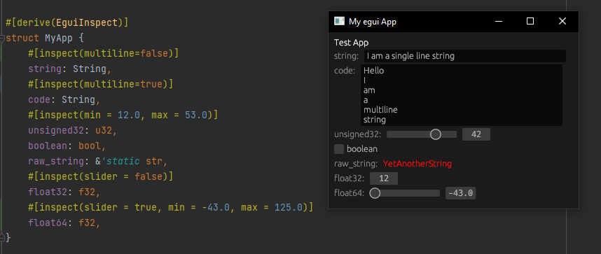

# egui_inspect

This crate is intended to provide some rust helper macros to automatically generate boilerplate code to inspect
structures

Its goals are:

- to provide as much compile-time generated code as possible, avoiding conditional branches at runtime
- to be hyper user-friendly

There is a `EguiInspect` trait which is necessary for a struct to be inspected. This trait is implemented for most base
types, and can be generated for user created types with the macro `#[derive(EguiInspect)]`. If every underlying types
implements `EguiInspect`, then you will be able to inspect it.

This is a side project, at a very early state, so the API might not be stable yet.

# Example

You can inspect struct mutably and non-mutably. There is some customization per fields. There is no possibilities to
override field's name yet

To implement this example, you just need to add egui_inspect as dependency to your project, and then, when drawing you
ui with egui, you need to give your `&Ui` to the inspect function, no need for additional input .
See [example](egui_example/src/main.rs) to see a complete integration with the eframe crate